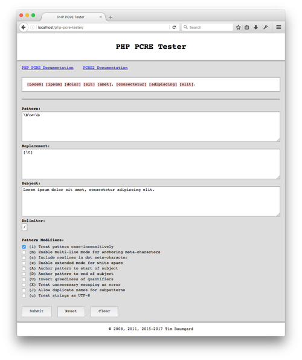

# PHP PCRE Tester

PHP PCRE Tester is a simple development tool that makes it easy to test Perl-compatible regular expressions as used in PHP. Open it up in your browser, give it a regex pattern, an optional replacement value, and a subject, and it gives you the result with the matched portions of the subject highlighted and optionally replaced.

It requires a web server, PHP 7, and a browser.

## Screenshot

## License

&copy; 2008, 2011, 2015-2017 Tim Baumgard. This tool is licensed under [GPL v3.0](https://www.gnu.org/licenses/gpl-3.0-standalone.html).
